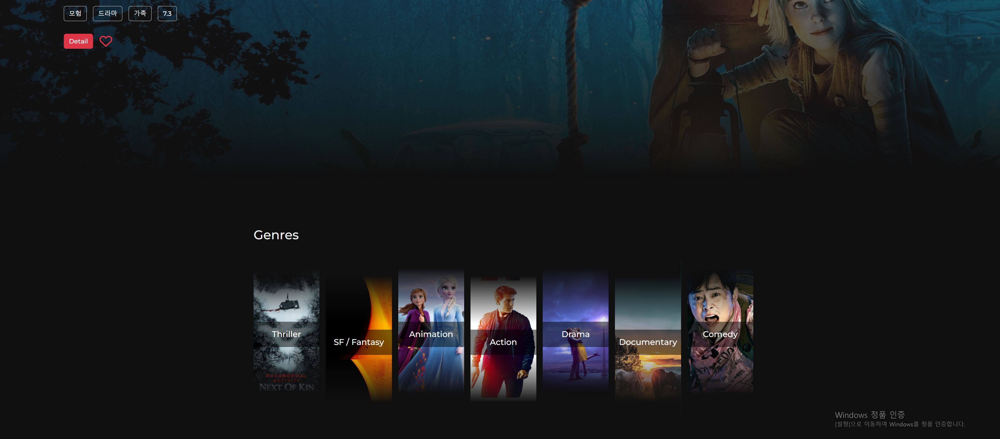

# [FINAL PJT] 영화 추천 서비스 만들기

​																																						      작성자: 신희재, 원민석
​																																								작성일: 2022. 5. 22

## 0. 프로젝트 구조

- /final-pjt-back : Django 프레임워크를 사용한 백엔드 서버
  - accounts : user관련 어플리케이션
  - communities : review기능 백엔드 어플리케이션
  - movies : movie 관련 어플리케이션
  - movie-whoe-data.json : 모든 데이터를 덤프한 json 파일 (4000여개 영화, 12000여명의 배우, 2000여명의 감독)

- /final-pjt-front : Vue.js 프레임워크를 사용한 프론트엔드 어플리케이션
- /recommendations : 자연어처리를 이용한 내용 분석 알고리즘을 포함하는 주피터노트북 전용 파일
- /etc : 기타 문서

## 1. 서비스 기획

- 이번 관통프로젝트의 목표를 크게 두 가지로 잡았습니다.
  1) 하나의 컨셉을 잡고 해당 컨셉에 충실하면서 통일적인 UX를 구현하자!
  2) 단순한 for문 돌리기나 독특한 아이디어의 비중이 높은 알고리즘(예컨대 날씨 API에 따라서 추천한다)이 아닌 실제로 사용될 수 있을 만한 실질적인 추천 알고리즘을 짜보자!
- 통일적인 UX를 구현하기 위해서는 뚜렷한 컨셉이 필요한데, 이번 프로젝트의 컨셉을 "장르별 최적화 UX 구현하기"로 잡았습니다. 
- 알고리즘을 위해서 추천 알고리즘의 종류를 검색해보았습니다. 그 중 추천 알고리즘이 크기 협업 필터링 알고리즘(유저 데이터 기반)과 컨텐츠 기반 추천 알고리즘으로 구분될 수 있다는 것을 알았습니다. 하지만 실질적인 유저를 확보할 수 없는 관통 프로젝트 특성 상 컨텐츠 기반 추천 알고리즘을 구현해보기로 결정했습니다.
- 컨텐츠 기반 추천 알고리즘은 컨텐츠의 내재적인 속성들을 알고리즘의 인풋 정보로 활용하는 알고리즘을 통칭합니다. 유저에 대한 직접적인 데이터를 사용하는 것보다는 효율이 떨어져 빅데이터가 활용되는 최근에는 잘 사용되지 않지만 여전히 비교적 쉽게 구할 수 있는 데이터를 활용할 수 있다는 장점 덕분에 협업 필터링을 보완하는 용도로 사용됩니다. 
- TMDB에서 얻을 수 있는 정보 중에서 컨텐츠 기반 필터링의 인풋으로 사용할 수 있는 가장 유력한 후보로 장르를 생각했습니다. 직관적으로 생각했을 때 장르는 영화의 내용과 큰 상관관계를 갖기 때문에 영화 간의 유사성을 기반으로 하는 컨텐츠 기반 추천 알고리즘에 꽤 괜찮은 데이터를 제공할 것으로 기대되었습니다. 특히 우리 프로젝트의 컨셉은 장르 기반의 UX에 충실하는 것이었기 때문에 장르 데이터를 가장 우선적인 인풋 요소로 결정했습니다.
- 하지만 문제는 장르 데이터는 범주의 개수가 너무 적고, 하나하나의 범주가 커버하는 내용적 영역이 너무 크다는 데 있었습니다. 그래서 장르만으로는 실질적으로 유사한 영화라고 느껴질 만한 영화를 줄줄이 추천하는 데는 한계가 있었습니다. 따라서 하나의 필드를 더 반영해서 추천 기반으로 삼기로 했습니다.
- 최종적으론 TMDB 사이트에서 제공하는 'overview', 즉 줄거리 필드를 추천 서비스의 인풋 데이터로 사용하기로 했습니다. 이번 기획에서 우리는 (genre, overview) 두 필드를 기준으로 컨텐츠 유사성을 도출하여 추천 알고리즘으로 사용할 것입니다.

(추천알고리즘에 관한 개요 https://tech.kakao.com/2021/12/27/content-based-filtering-in-kakao/)

## 2. 구현 과정

### 2.1. 클라이언트 사이드

- UX의 경우 크게 깊이적으로는 네 가지 층위로 화면을 구성하고, 각각의 장르마다 고유한 UX를 가지는 입장 화면을 부여해 분위기를 살리고자 했습니다. 
- Vue.Js를 사용하여 SPA을 구현하였습니다.
- FE는 구현된 화면의 스크린 캡쳐로 대체합니다.

**<Flow Chart>**

**<MainPage>**

<MainPage>

<Genre Entrance>

 <Genre Main Page>

<Genre Carousel>

<Profile>

### 2.2. 서버사이드

- 서버 사이드는 장고 프레임워크로 구성하였습니다. 인증과 권한은 rest framework 라이브러리에서 제공하는 기능을 사용하여 대체하였습니다.
- 기본 CRUD를 구현하였습니다. 영화마다 리뷰를 작성할 수 있으며, 작성된 리뷰는 개별 영화마다 조회, 장르 전체에 대한 조회, 그리고 작성자별 조회 등 다양하게 조회할 수 있습니다. 작성자는 리뷰를 작성하면서 별 표시를 통해서 평점을 제공하고 작성된 리뷰에 대해 다른 유저들은 좋아요와 싫어요를 표시할 수 있습니다. 리뷰에 대한 수정 및 삭제는 작성자에게만 허용됩니다.
- 장고 M to N 관계를 통해서 팔로잉/팔로워를 구현하였습니다. 팔로잉/팔로워는 비대칭적인 관계이며 프로필 화면에서 해당 유저를 팔로우하거나 팔로잉하는 유저의 수를 볼 수 있습니다.

- 서버사이드의 주된 작업은 위에서 말했듯 추천 알고리즘을 작성하는 것이었습니다. 추천알고리즘의 경우 크게 세 가지 알고리즘을 구현했습니다.
  - **이 장르의 TOP 10**: 해당 장르의 특정 평점과 특정 평점수 이상의 영화들 중 가장 평점이 높은 영화들을 뽑아주는 알고리즘. 해당 장르 구분에 속하는 장르 번호들에 해당하는 영화들을 ORM으로 조회하고 평점순으로 송출하는 간단한 함수 사용.
  - **내가 팔로잉한 사람이 좋아하는 영화:** 팔로잉한 유저들이 경우, 그 사람들이 좋아하는 영화를 조회하고 리스트에 추가한 다음 랜덤으로 10개를 뽑아주는 기능. 이 또한 ORM을 사용하여 비교적 쉽게 구현할 수 있다.
  - **어쩌면 좋아할 거예요**: **컨텐츠 기반 추천 알고리즘**. 사실상 이번 서버사이드 작업에서 가장 큰 비중을 차지하였다. 해당 알고리즘의 개요는 앞서 말한 것처럼 overview와 장르를 인풋으로 컨텐츠 기반 필터링 알고리즘을 만드는 것이었다. 장르의 경우 각 영화와 장르가 가장 많이 겹치는 영화들을 순서대로 가중치를 매겨 구현하면 되겠지만 문제는 overview를 사용하여 추천알고리즘을 짜는 것이었다. 자세한 내용은 **3.2**로 갈음한다.

## 3. 마주친 문제점과 해결 과정

### **3.1. Vue.js의 LifeCycle Hook**

- Vue.js를 사용하면서 가장 많은 문제를 일으켰던 것은 Vue객체의 Life Cycle Hook이었다.  Vue 객체가 탄생하고 소멸하기까지 거치는 일련의 과정에서 원하는 작업이 어떤 순서에 들어가는지를 명확하게 파악하지 않으면 페이지 렌더링 시점에 원하는 효과가 나지 않기 일쑤였다. 

- 그 중 다음의 에러가 가장 기억에 남는다:

  - 

  

  -  문제 파악 결과, 원인은 에러가 발생하는 개체가 렌더링 시작될 시점에 아직까지 응답이 도착하지 않아서 렌더링 필요한 정보가 undefined로 평가되어서 에러가 계속 발생하는 것이었다. 찾아본 결과  v-if 를 사용해서 값이 오기 전까진 렌더링 자체를 차단 (https://jess2.xyz/vue/data-undefined-error/)하는 방법을 사용하면 해결할 수 있다고 하여 적용하였는데, 대부분의 문제는 해결되었지만 하나의 자리에서 계속해서 에러 메시지가 발생하였다. 해당 문제는 해결하지 못하였지만, 주요 기능 동작에는 전혀 문제가 없다.

### 3.2. overview 기반 추천 알고리즘

- 한국어 overview를 사용해서 리뷰마다  중요한 단어가 얼마나 중복되어 사용되는지를 분석하는 방법을 사용하기로 하였다. 다음은 알고리즘을 이해하기 위해 필요한 최소한의 개념이다.

  - TF/IDF(term frequency / inverse document frequency): 텍스트 마이닝에서 특정 단어의 가중치를 결정하기 위해 사용하는 개념이다. 아이디어 자체는 간단한데, 특정 문서에서 특정 단어가 전체 단어에서 차지하는 비중이 높다면 그 단어는 해당 문서의 feature가 될 법한 중요한 단어라는 것이다. 따라서 우선 특정 문서에서 특정 단어가 얼마나 자주 사용되는지 빈도를 측정한다(TF). 하지만 어떤 단어들(예컨대 '사람', 혹은 영화 리뷰 문서에서는 '인물', '영화' 등)은 어떤 상황에서든 일상적으로 사용되는 범용어이기 때문에 해당 단어게 얼마나 자주 사용되는지는 영화의 특질에 대한 어떠한 힌트도 주지 못할 수도 있다. 따라서 전체 문서군에서 어떤 단어가 얼마나 자주 사용되는지를 측정하고, 해당 수치를 앞서 구한 한 문서 내 단어의 빈도에 대하여 나눠준다면(IDF) 해당 단어가 범용어라서 과대 대표되는 것을 막을 수 있을 것이다. TF/IDF는 특정 레코드의 모든 단어에 대해서 주어진다
  - 코사인 유사도: 코사인 유사도는 내적 공간의 두 벡터간 각도를 코사인 값을 사용하여 얼마나 유사한지 측정하는 것이다. 간단히 예를 들자면 S1 ''강아지는 충격적으로 귀엽다""와 S2 고양이는 야무지게 귀엽다, S3 "고양이는 충격적으로 무섭다"가 있다면 '는', '으로', '게'와 같은 불용어(stop word)를 처리한 결과(물론 형태소처리까지 마쳐야 한다) S1, S2는 '귀엽다'를, S2와 S3는 '고양이'를 공유하고 있으며 S1과 S3은 '충격적'을 공유하고 있다. 이 경우 각각의 단어가 가지는 가중치가 모두 같다는 전제 하에서 각각의 문장들은 모두 같은 정도의 유사도를 가지게 된다. 하지만 앞서 TF/IDF를 적용했을 때 거의 모든 단어는 문장 내에서 다른 가중치를 갖게 될 것이므로 결과적으로 서로 간의 유사도는 모두 달라질 것이다. (참고) https://mac-user-guide.tistory.com/47, (장단점) https://velog.io/@crescent702/cos-similarity
  - 코사인 유사도는 양수값을 가지는 벡터에 대해서 다차원 벡터에서 비교적 간편하게 답을 구할 수 있다는 점에서 사용된다고 한다. (더 이해가 필요하다)

  

  - 기본적인 개념 공부 후에 코드로 구현해보았다.
    찾아보니 TF/IDF와 코사인 유사도는 데이터 분석에서 많이 사용되는 개념이기 때문에 해당 개념을 적용하기 위해서 이미 마련된 라이브러리들이 존재했다. pandas를 사용해서 벡터를 구성하고, Okt 라이브러리고 한국어 불용어를 확보하고 사이킷런 라이브러리를 사용해서 분석에 필요한 벡터화와 두 벡터간 코사인 유사성 구하기를 생각보다 간단하게 구현할 수 있었다. 

-  문제는 **원 데이터 자료의 질**에 있었다. TMDB는 영어 사이트이기 때문에 한국어 overview가 비교적 성의없게 제공되고 있거나 심지어는 많은 영화들에 대해서는 overview를 제공하지 않고 있었다.

- 그 결과 overview만으로 확보한 코사인 유사성 데이터에서 '니모를 찾아서'의 연관 영화로 '죠스'가 잡히는 어처구니없는 상황이 발생하였다(...) 아마도 바다/생선과 관련된 단어들이 겹쳐서였지 않을까.

-  데이터의 질을 높이면 이 문제를 해결할 수 있을 것이라고 생각했다. 따라서 이를 해결하기 위해서 TMDB API에서 영어 overview를 원래있던 데이터셋에 추가하였다. 그 후 NLTK 라이브러리를 통해서 영어에 대한 불용어 처리와 토크나이즈(문장을 형태소/불용어를 고려하여 토큰화하여 배열에 넣는 것)를 하는 과정을 추가하여 영어에 대한 overview 유사도를 뽑아내었다. 

  - 결과적으로 영어 overview로 뽑아낸 유사도 데이터는 꽤 만족스러웠다. 시리즈물은 서로에 대한 유사 영화로 대부분 추추천되었으며, 시리즈물이 아니더라도 실제로 내용적으로 유사한 영화들이 많이 추가되었다. 하지만 여전히 **서로 다른 장르의 영화 중에서 줄거리의 단어가 겹치는 영화들이 추천되는 현상이 발생하여 약간은 불만족**스러웠다.

- overview 처리를 위해서 배운 코사인 유사성 개념을 사용해서 장르에도 적용하면 더 편리하게 정확한 데이터를 얻을 수 있을 것으로 생각했다. 특정 영화의 장르 개수는 2개 이상일 수 있는데, 그 중에서 여러 개가 겹치는 경우에 더 높은 유사성을 부여할 수 있기 때문이다. 따라서 장르를 기반으로 한 코사인 유사성을 기록한 후 영화 간의 eng_overview와 장르 유사성을 각각에 특정 가중치를 곱해주어 합산하면 위에서 **장르가 유사한 영화** 중에서 **내용이 유사한 영화**를 우선적으로 추천하는 효과를 거둘 수 있을 것이라고 생각했다.

  - 장르에 0.5, 내용에 0.5를 가중치로 부여했을 때는 내용 유사성이 거의 무시되는 효과가 나타났다. 이는 장르가 같으면 유사성이 1이며, 장르가 4개 중 3개만 겹쳐도 유사성이 0.75인 반면 내용은 아무리 유사해도 0.3을 잘 넘어가지 않기 때문에 발생하는 일이었다.
  - 몇 번의 휴리스틱을 위한 시도 끝에 약 내용에 0.8, 장르에 0.2 정도의 가중치를 줬을 때 원하던 결과와 가까운 추천 결과가 나왔다.

- 결과를 매번 계산하는 것은 실제 어플을 사용해당 파일을 Pickle 라이브러리를 통해서 파일화하고, views.py에 임포트하여 사용하였다. 

